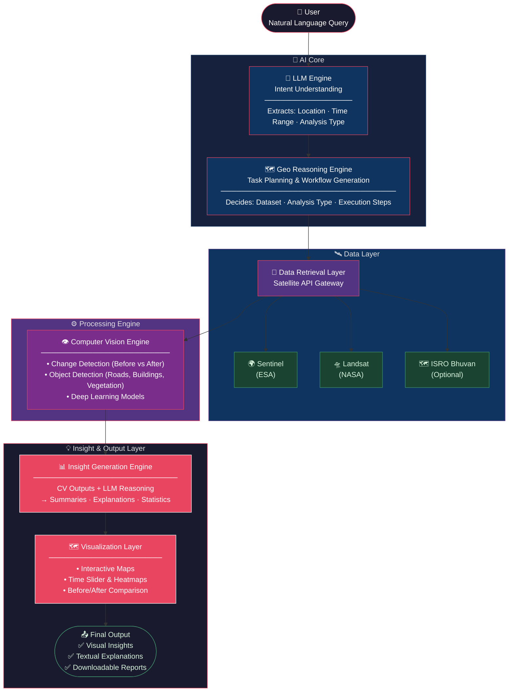
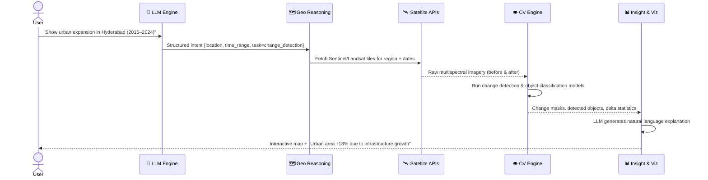
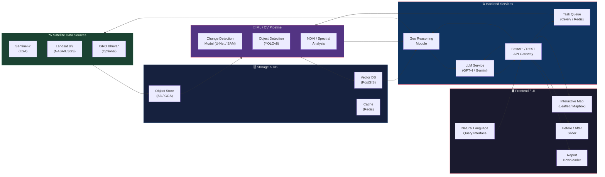

# 📄 AI Earth Intelligence System

### *System Architecture of the Proposed Solution*

---

## 1. Overview

The proposed system, **AI Earth Intelligence System**, is designed to analyze satellite imagery and provide actionable insights through natural language interaction. It integrates **remote sensing data, computer vision, and large language models (LLMs)** to simplify complex geospatial analysis.

The system enables users to query satellite data using plain language and receive **visual + explainable insights** about environmental changes, urban growth, and land-use patterns.

---

## 2. System Architecture

### 2.1 High-Level Architecture Diagram

---

### 2.2 Data Flow Diagram

---

### 2.3 Component Architecture

---

## 3. Architecture Description

| Layer | Component | Responsibility |
|-------|-----------|---------------|
| 🎯 Input | User Interface | Accepts natural language queries |
| 🧠 Understanding | LLM Engine | Extracts location, time range, and analysis type |
| 🗺️ Planning | Geo Reasoning Engine | Generates geospatial task workflows |
| 🛰️ Data | Data Retrieval Layer | Fetches Sentinel / Landsat / Bhuvan imagery |
| 👁️ Processing | Computer Vision Engine | Change detection & object classification |
| 💡 Intelligence | Insight Generation | LLM + CV fusion → explanations & statistics |
| 🗺️ Presentation | Visualization Layer | Interactive maps, heatmaps, time sliders |
| 📤 Output | Output Layer | Reports, visual insights, explanations |

---

### 3.1 User Layer
- Accepts natural language queries
- Example: *"Show urban expansion in Hyderabad from 2015 to 2024"*

### 3.2 LLM Engine (Understanding Layer)
- Processes user queries and extracts: **location**, **time range**, **analysis type**
- Converts query into a structured format for downstream modules

### 3.3 Geo Reasoning Engine (Planning Layer)
- Breaks query into geospatial tasks
- Decides which dataset to use and what analysis to perform
- Generates a step-by-step execution workflow

### 3.4 Data Retrieval Layer
- Fetches satellite data from: **Sentinel (ESA)**, **Landsat (NASA)**, **ISRO Bhuvan** (optional)

### 3.5 Computer Vision Engine
- Performs **change detection** (before vs. after images)
- Runs **object detection** (roads, buildings, vegetation) using deep learning models

### 3.6 Insight Generation Engine
- Fuses CV outputs with LLM reasoning
- Generates: summaries, explanations, and statistics

> *"Urban area increased by 18% due to infrastructure growth."*

### 3.7 Visualization Layer
- Interactive map-based interface with **time slider**, **heatmaps**, and **before/after comparison**

### 3.8 Output Layer
- Delivers: **visual insights**, **textual explanations**, and **downloadable reports**

---

## 4. Key Innovations

- 🌐 Natural language interaction with satellite data
- 🤝 Integration of Computer Vision + LLM + Geospatial AI
- 🔄 Automated change detection and reasoning
- 🔍 Explainable AI-based insights
- 🔗 Unified end-to-end pipeline

---

## 5. Conclusion

The proposed architecture transforms raw satellite data into meaningful insights through an intelligent, automated pipeline. By combining multiple AI paradigms, the system reduces complexity and enables **non-experts to perform advanced geospatial analysis**.

---

## 🧠 One-Line Summary

> **"An AI system that understands Earth through satellite data and explains it like a human expert."**
